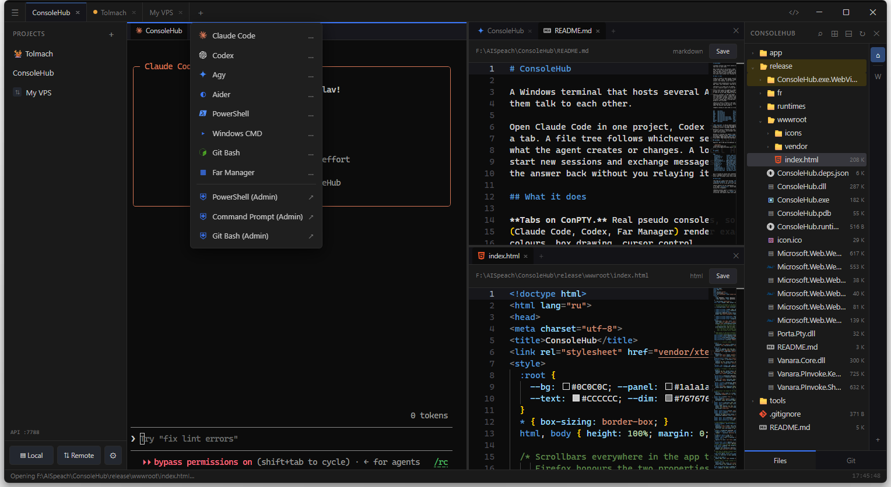

# ConsoleHub v1.0.9



A Windows terminal that runs several AI coding agents side by side and lets them
talk to each other over a local HTTP API.

Open Claude Code in one project, Codex in another, a shell in a third — each in
its own tab. Split the window into panes. An agent can list the others, start new
ones, send them work and read the answer back, all through the API at
`http://127.0.0.1:7788`. This works over SSH too: an agent on a server reaches the
same API as the ones on your machine.

This folder is a ready-to-run build — no compiler needed, just run the exe.

## Run it

1. Download or clone this folder.
2. Double-click **`ConsoleHub.exe`**.

Requires Windows 10/11 and the WebView2 runtime — already present on current
Windows. If it is missing, get the Evergreen runtime from Microsoft:
<https://developer.microsoft.com/microsoft-edge/webview2/>. The .NET runtime is
bundled.

## What it does

**Tabs on ConPTY.** Real pseudo consoles, so full-screen terminal interfaces
(Claude Code, Codex, Far Manager) render as they do in Windows Terminal — colours,
box drawing, cursor control.

**Agents found automatically.** Anything on `PATH` is offered: Claude Code, Codex,
Aider and more, plus PowerShell, CMD and Git Bash. Add your own in `agents.json`.

**Split panes.** Drag a tab onto the edge of a pane to split it. The layout is
saved and restored, and agents can arrange it over the API.

**Projects.** A saved list of folders. Click one to start its agent.

**Remote projects over SSH.** Add a project on any host from your `~/.ssh/config`
and work on it as if it were local: the file tree, opening and saving files, git
and terminals all run on the server over one SSH connection. A file dropped from
Explorer uploads to the host. Nothing is installed on the server — it uses the ssh
you already have. Agents started on the host join the local API through the
connection.

**Command Runner.** A **Run** tab with per-project command sequences you launch
with a click. Running one opens a session in the project and types the commands
in — on the server for a remote project. Groups, filter, environment variables,
auto-close, URLs, programs, and `${input:Label}` prompts. Agents can manage and
run these over the API.

**File tree.** Live updates, bookmarks, and file operations — create, rename,
delete, move, copy — by menu or drag-and-drop, local or over SSH. Multi-select and
copy or cut to the Windows clipboard, and paste from it, including copying files
out of an SSH tree to your machine. Search inside files, project-wide, jumping to
the matching line, local or over SSH.

**Editor.** Monaco, the core VS Code uses: syntax highlighting (Blade and XAML
included), find and replace, minimap, and a settings tab for font, wrap, cursor
and line numbers. Markdown has a live side-by-side preview; images open in a
viewer with zoom and pan. A file changed on disk reloads when you have no unsaved
edits, and asks before overwriting when you do — over SSH as well.

**Source control.** Branch with ahead/behind, stage, commit, push, pull, and a
unified diff. It follows the folder on screen, so a bookmarked subfolder with its
own repository shows that one.

**Panels.** The projects panel floats over the content and closes on an outside
click, or pins open. The file tree sits on the left or the right of the terminals.
An agent can flash a project's tab to signal it needs you.

## Agents working together

Every session has an id and reaches the hub at `http://127.0.0.1:7788`. Over plain
HTTP an agent can start another, send it a message, read its answer, show a file
to the user, run saved commands, and arrange the panes.

The skill in [`skill/SKILL.md`](skill/SKILL.md) documents the API. Hand it to an
agent and say "create a skill named consolehub from this", and it will know how to
use ConsoleHub. The same reference is served at
`http://127.0.0.1:7788/api/help`, and ready-made prompts are in **Settings → Readme**.

```bash
# from inside a session — see who is around, then hand off a task
curl -s "$CONSOLEHUB_API/api/sessions/$CONSOLEHUB_SESSION/peers"
curl -s "$CONSOLEHUB_API/api/sessions/<their id>/send" \
  -H 'Content-Type: application/json' \
  -d "{\"text\":\"This is $CONSOLEHUB_SESSION. Please <task>. Reply to /api/sessions/$CONSOLEHUB_SESSION/send.\"}"
```

Agents are not modified — they start as they would from a plain terminal and find
each other through `CONSOLEHUB_SESSION` and `CONSOLEHUB_API` in their environment.

## Source

The source lives in a separate repository. This one carries the compiled build so
it can be run without a toolchain.

---

Built with .NET 9 (WinForms + WebView2), xterm.js, ConPTY and Monaco.
